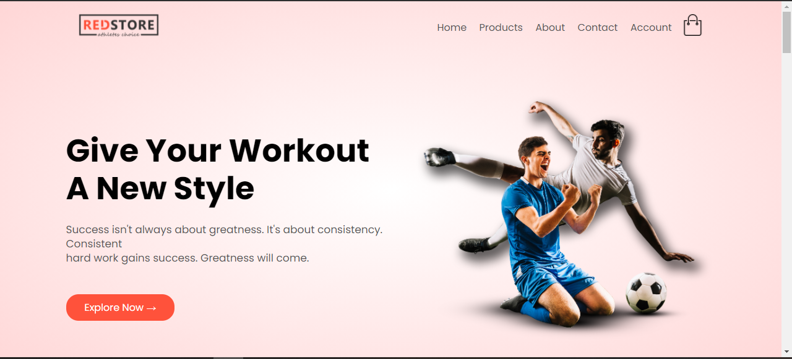
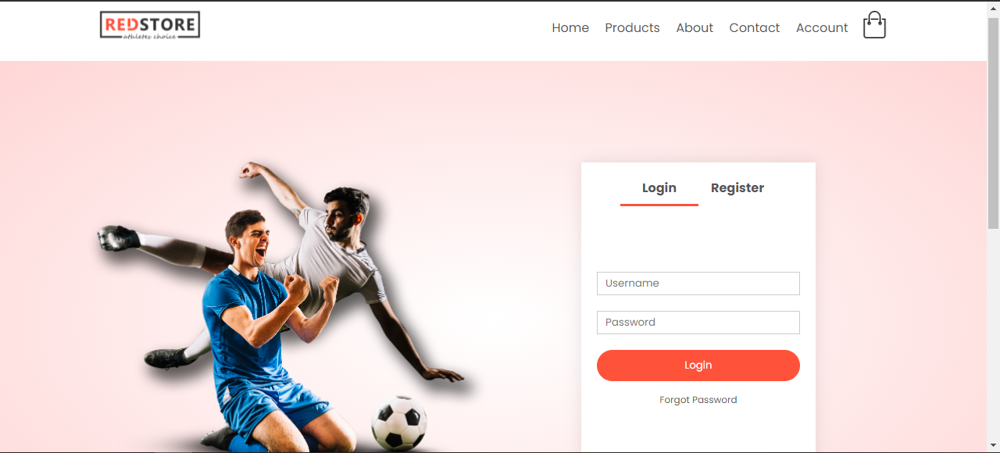
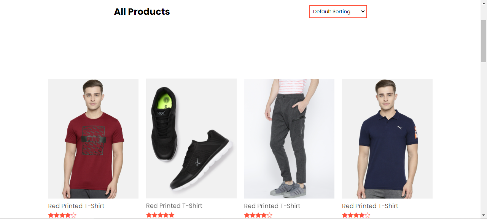

## ShopOn E-Commerce

A React based website for shopping. A static website build with React.js to build up skills in React UI.
It also has a  backend API created with Node.js and Express.js with MongoDB as a database.

## Preview Shots
###### Home Page

###### Accounts Page

###### Products Page

## Tools Used
* React for front end
* MongoDB as database
* Express for API development

## How to Run
1. Clone this repository into your local computer.
2. Make sure you have node installed.
3. Run following command to install packages in **frontend/**.
 > npm install 
4. Run following command to install packages in **backend/**.
 > npm install 
5. Start MongoDB server for database.
6. Start backend server with following command
>npm start
7. Start frontend react server with the same command
> npm start
8. You should see the **Landing** page once the server is started.
9. This will create **notes** database in your MongoDB.

Follow me on [LinkedIn](https://www.linkedin.com/in/utkarsh-kore-175080174/)
Thanks, Happy Coding!